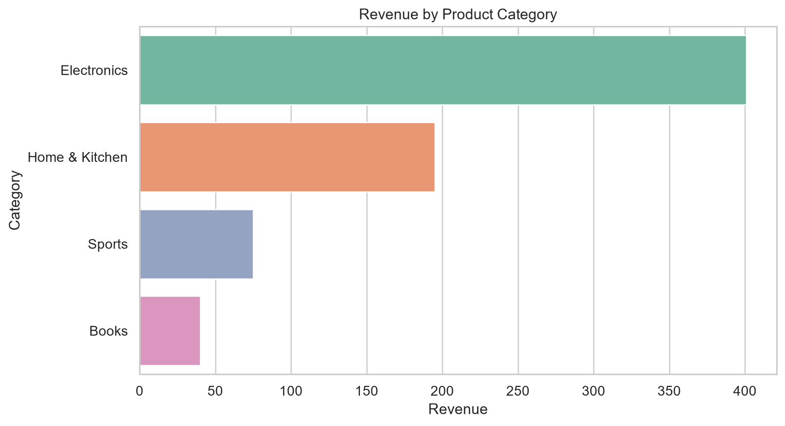
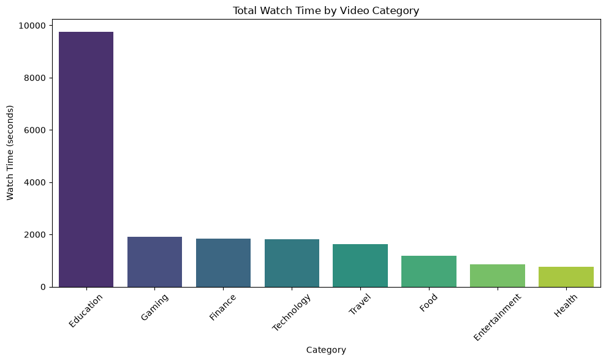
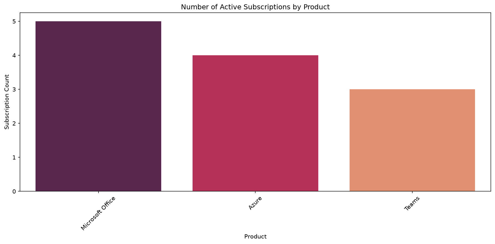
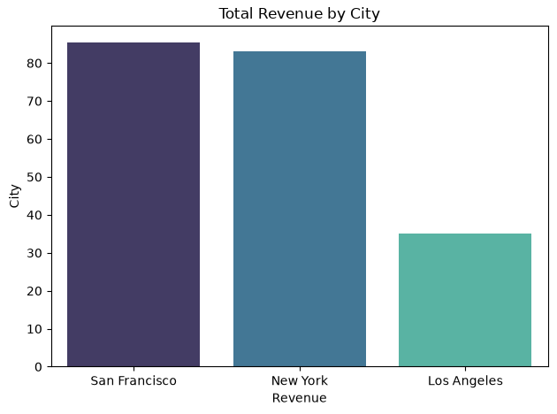

# Big Tech Data Analytics Case Studies

SQL and Python analytics case studies modeled on business scenarios at **Amazon**, **Google**, **Microsoft**, and **Uber**. Each case includes a relational dataset, schema diagram, documented SQL solutions, a Jupyter notebook with Pandas analysis, and exported visualizations.

Use this repo for interview prep, SQL practice, or as a data analytics portfolio piece.

---

## At a glance

| Case study | Domain | SQL queries | Notebook | Charts |
|---|---|---:|---|---:|
| [Amazon](./Amazon/) | E-commerce & logistics | 14 | Yes | 6 |
| [Google](./Google/) | Search, ads & video | 16 | Yes | 6 |
| [Microsoft](./Microsoft/) | SaaS subscriptions & support | 20 | Yes | 6 |
| [Uber](./Uber/) | Ride-sharing operations | 11 | Yes | 4 |

**61 SQL problems · 4 notebooks · 22 visualizations**

---

## What's in each case study

Every company folder follows the same layout:

| File | Purpose |
|---|---|
| `{Company}_dataset.xlsx` | Multi-sheet relational dataset |
| `{Company}_dataset_schema.png` | Entity-relationship diagram |
| `{Company}_SQL_*_Answers_and_Insights.md` | SQL questions, queries, results, and insights |
| `{Company}_Pandas_*_Visualisations.ipynb` | Pandas analysis and chart generation |
| `*.png` | Exported visualization outputs |

---

## Case studies

### Amazon — E-commerce & logistics

Analyze a simulated Amazon platform: warehouses, orders, sellers, inventory, Prime members, and customer reviews.

**Highlights:** seller performance rankings, inventory restocking risk, high-value customer segmentation, employee hierarchy reports, purchase gap analysis.

**Sample output:**



[Browse Amazon case study →](./Amazon/)

---

### Google — Search, ads & video

Analyze user search behavior, ad click revenue, and video watch time across a simulated Google platform.

**Highlights:** daily active search users, consecutive-day engagement, ad revenue by country, top videos by watch time, revenue contribution percentages.

**Sample output:**



[Browse Google case study →](./Google/)

---

### Microsoft — SaaS subscriptions & support

Analyze subscriptions, product usage, and support tickets on a simulated Microsoft platform.

**Highlights:** revenue by product, above-average usage users, support ticket distribution, fully engaged users across subscriptions + usage + support.

**Sample output:**



[Browse Microsoft case study →](./Microsoft/)

---

### Uber — Ride-sharing operations

Analyze drivers, riders, trips, surge pricing, and promotions on a simulated Uber platform.

**Highlights:** peak-hour demand, driver performance by city, rider retention with window functions, promotion effectiveness, revenue by city.

**Sample output:**



[Browse Uber case study →](./Uber/)

---

## Skills covered

**SQL (SQLite dialect)**
- Filtering, sorting, and basic aggregations
- INNER, LEFT, and self-joins
- GROUP BY, HAVING, and subqueries
- Common Table Expressions (CTEs)
- Window functions: `RANK`, `PARTITION BY`, `LAG`
- Date functions: `strftime`, `julianday`, `DATE`

**Python / data analysis**
- Pandas data loading and manipulation
- Exploratory analysis and insight writing
- Matplotlib and Seaborn visualizations

---

## Getting started

### Prerequisites

- Python 3.8+
- Jupyter Notebook or VS Code
- A SQLite-compatible SQL client (optional — DB Browser for SQLite, DBeaver, etc.)

### Install dependencies

```bash
pip install pandas numpy matplotlib seaborn openpyxl jupyter
